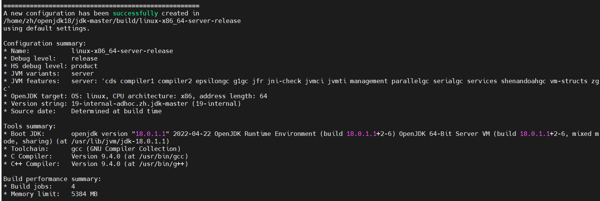

# High CPU

# Leaky of Memory

USS: unique set size

PSS: proportional set size

VSS: virtual set size

RSS: Resident set size

VSS >= RSS >=PSS >= USS

# avoid null pointer

put constant or java box type in the left side when using ```equals```

# == and equals

```==``` is refer to two object whether point to the same address.

```equals``` is refer to if the hash value of the two object are equal

# magic number

which is other people might not understand.

# Strings convert to numbers may throw NumberFormatException

# Calender

1 is Sunday, 0 is the January.

recommend to use Calender.DECEMBER

# Serilization

SerialVersionUID must be static, final and long type

private writeObject and readObject

transient: ignore member

ObjectStreamField

# tricks

HashMap can put null key and null value

HashTable and TreeMap can not put null key and null value

default length of  ArrayList is 0 (```DEFAULT_INITIAL_CAPACITY```)

defailt of HashMap, HashSet and StringBuffer is 16


# [pass-by-reference or pass-by-value](https://stackoverflow.com/questions/40480/is-java-pass-by-reference-or-pass-by-value/40523#40523)

# [how to define a hashcode](https://stackoverflow.com/questions/27581/what-issues-should-be-considered-when-overriding-equals-and-hashcode-in-java)

Whenever a.equals(b), then a.hashCode() must be same as b.hashCode(). Therefor when overriding equals(), hashcode() must be overrode.

When using a hash-based Collection or Map such as HashSet,  or LinkedHashSet, HashMap, Hashtable or WeakHashMap make sure tha in the hashCode() of the key object  never changes.

notice: Map searching objects will compare ```hashcode``` at first, then compare ```equals```

# toUpperCase() toLowerCase()

Locale.ENGLISH

# Integer

recommend to use ```valueof```. -128~127 will return the inner array of IntegerCache


# deep cloning and shallow cloning

implement Cloneable and override clone()

# ```>>>``` and ```>>```

char, byte and short type will convert to int type

```>>>``` is use 0 to put in the left

```java
        byte a = (byte) 0xf3;
        System.out.println(a); //0xfffffff3
        int b = (byte)a >>> 3; //0x1ffffffe
        byte c = (byte) b; //0xfe
        System.out.println(b);//0x1fffffffe
        System.out.println(c);//0xfffffffe
```

# $$ || and & |

$ and | will judge all condition.

# [Difference between HashMap, LinkedHashMap and TreeMap](https://stackoverflow.com/questions/2889777/difference-between-hashmap-linkedhashmap-and-treemap)

# [New Integer vs valueOf](https://stackoverflow.com/questions/2974561/new-integer-vs-valueof)

Integer.valueOf() -128~127 will return from IntegerCache

# [Performance considerations for keySet() and entrySet() of Map](https://stackoverflow.com/questions/3870064/performance-considerations-for-keyset-and-entryset-of-map)

above 10000, entrySet > keySet, especially TreeMap
# [java.io.InputStream()](https://docs.oracle.com/javase/7/docs/api/java/io/InputStream.html)
 + ```long skip(long n)```: if n is negative, no bytes are skipped

# [static initialization code vs instance initialization code](https://stackoverflow.com/questions/335311/what-is-the-difference-between-a-static-and-a-non-static-initialization-code-blo)

# StringBuilder

StringBuilder run faster in a single tread than others.

specific capacity will improve 45%

# BigDecimal

compareTo: inefficiently

equals: this method considers two objects equal only if they are equal in value and scale 


# [immutable class](https://stackoverflow.com/questions/3162665/immutable-class)

with private final member and no setter and no getter

# SecurityManager

```SecurityManager securityManager = System.getSecurityManager();```

default policy path is ${java.home}/lib/security/java.policy

java -Djava.security.policy= to set user policy path


# break label

break the label code block and continue to run other code

# Switch type

char, byte, int,  short, Character, Byte, Short, Integer, enum, String. except for boolean, long, unsigned int

Java 7 support java.lang.String

**wrap type can not be placed behind case**

# Interface and Abstract Class

A class can implements multiple Interfaces 

# protected and default 

default access modifier is more restrictive than the protected access modifier

access-modifier must be less restrictive than the one in parent

protected access modifier is visible to classes in the same package , sub-classes and sub-classes of  different package.

default acess modifier is visible to classes in the same package and sub-classes in the same package
https://stackoverflow.com/questions/47412049/protected-and-default-modifier-java

https://stackoverflow.com/questions/9035052/cannot-reduce-visibility-of-method-inherited-method-from-parent

https://stackoverflow.com/questions/6851612/when-overriding-a-method-why-can-i-increase-access-but-not-decrease-it


**private method of superclass cannot be hiding.  Properties， static method  and inner class can be hiden.**


# Interface Default Method  
java8  
if a class implements multiple interface with the same default method. The compiler will throw error because compiler can't figure out which method need to be called.  

if a class extend class and implement interface with then same default method. The compiler will don't throw error, because the compiler will first use parent default method.  


# Functional Interface 
java.util.function

Consumer<T>  
Function<T,R>  
Supplier<T>  
Predicate<T>  

# clonable

implements Cloneable  
protected Object clone() throws CloneNotSupportedException

# finalize

normally it should be overridden to clean-up non-Java resources ie closing a file 
finalize() is never run more than once on any object  
It may take **more than one GC cycle** before the GC determines that a specific object is unreachable. (Java GCs are typically "generational" collectors ...) 

# foreach
remove and modify item are not good. Traversing multiple sets in parallel is not good.  

# weak reference and strong reference

# annotation

Target, Filed, Constructor, Method

# FileNotFoundException

can see the file system structure

# ArrayIndexOutBoundsException

divide 0

# Runtime, Process, ProcessBuilder

# SecureRandom 

```java
byte[] values = new byte[128];
SecureRandom random = new SecureRandom();
random.nextBytes(values);
```

# jmap, jstackm, jstat, jinfo javac

jmap -histo  
jstat gcutil  
javac -source 5/6/7/8  

# jvm server and client

java -version

# parameter

-XX:MetaspaceSize   
MaxMetaSpacSize  
Xms  
-XX:ThradStackSize

# Junit


# Synchronize


Hashtable and Ventor are synchronize.

TreeSet and LinkedList  are not synchronize.


# DOS attach

javax.nameing.InsufficientResourcesException

java.lang.OutofMemoryerror

java.lang.StackOverFlowError


# System.exit()


# interface

public static final var

public abstract method

default method? use reflection to verify this.

 # opton

deal with nullpoint


# assertion

begin with 1.4

Add option to open assertion ```-enableassertions``` or ```-ea```. Close option is ```--disableassertion``` or ```-da```

assertion is closed by default, so do not use assertion in predicate logic.

eg,

+ assert <bool expression>; 

+ assert <bool expression> : <message>; 

  

# Build the jdk source code

reference https://openjdk.java.net/groups/build/doc/building.html


If you need proper JDK version, you can download them from https://jdk.java.net/18/ and copy them to /usr/lib/jvm/

In my Ubuntu OS , I need below softwares to finish "bash configure"

sudo apt-get install libasound2-dev autoconf libcups2-dev libfontconfig1-dev libx11-dev libxext-dev libxrender-dev libxrandr-dev libxtst-dev libxt-dev




# Note of "Java Cookbook"

code url:

+ http://github.com/IanDarwin/javasrc 
+ http://github.com/Iandarwin/darwinsys-api
+ http://github.com/IanDarwin/javasrcee
+ 
+ 
